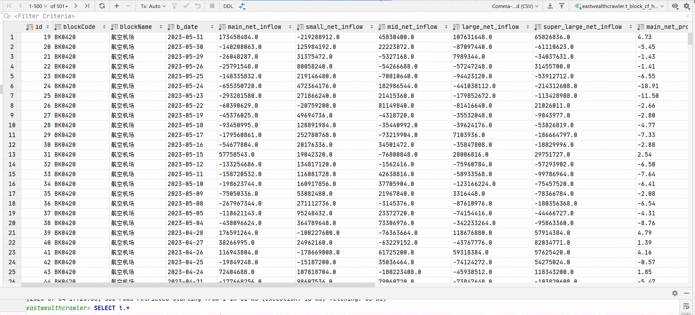
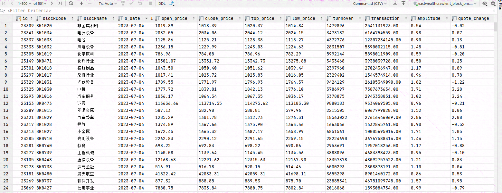
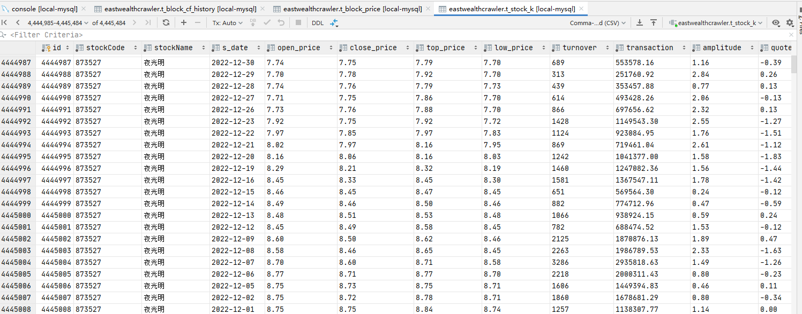

# 说明
## 实现
> 1，爬取股票板块历史资金流
> 
> 2，爬取股票板块历史价格信息
> 
> 3，爬取5000多个股票的历史价格数据

## 运行
### 1，创建数据库
> 创建`eastwealthcrawler`MySQL数据库
> 
> 用户密码在`settings.ymal`文件里面修改

### 2，启动
> `main.py` ，直接运行
> 
> `scheduler.py` ，可执行定时任务 

## 结果

### 数据库
板块资金流

板块历史价格

5000多个股票历史数据（每个股票大概1000行，总共四百多万行）

# 补充
> `s_block`包下面有一个`blockCrawl_gevent`的文件，利用了 `gevent` 库进行高并发爬取数据。但是我并不提倡高并发爬虫，这对目标网站不友好。
> 
> **使用`gevent`短时间发起大量请求，会被目标主机强行关闭连接。如有学习需要，最好自行购买IP池进行爬取数据。**