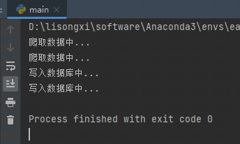

# 说明
## 实现
> 1，爬取股票板块历史资金流
> 
> 2，爬取股票板块历史价格信息

## 运行
### 1，创建数据库
> 创建`eastwealthcrawler`MySQL数据库
> 
> 用户密码在`settings.ymal`文件里面修改

### 2，启动
> `main.py` ，直接运行
> 
> `scheduler.py` ，可执行定时任务 

## 结果
### 1，窗口输出

### 2，数据库

